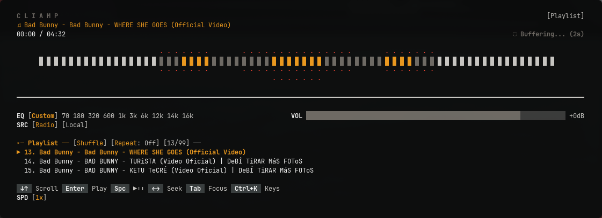

# cliamp-plugin-nightrider

A dynamic, center-expanding spectrum visualizer for [cliamp](https://cliamp.stream). It features discrete bars that grow outward from the screen center, utilizing an intensity-based color gradient that shifts from white to red based on signal strength.



## Install

```bash
cliamp plugins install [YOUR_GITHUB_USERNAME]/cliamp-plugin-nightrider
