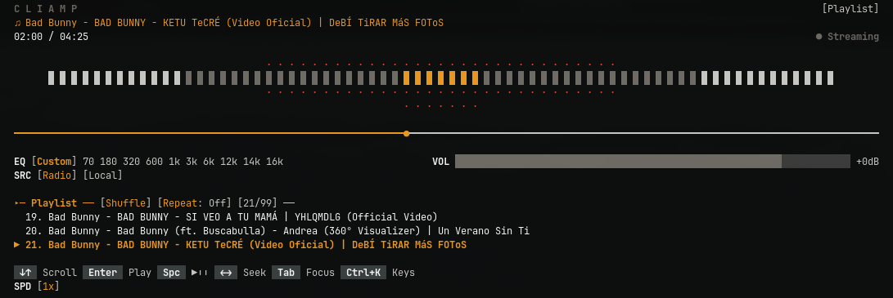

# cliamp-plugin-nightrider

A K.I.T.T.-style spectrum visualizer for [cliamp](https://cliamp.stream). Discrete bars bloom symmetrically from the centre and react to the **whole** audio spectrum, with a red-to-white intensity gradient. When nothing is playing it drops into an idle "Knight Rider" sweep — a glow gliding left and right while it waits for the music.




## Install

```bash
cliamp plugins install HANCORE-linux/cliamp-plugin-nightrider
```

Start `cliamp` and press `v` to cycle through the visualizers until `nightrider` appears.

```sh
cliamp plugins remove nightrider
```

## How it works

While audio plays, the plugin reads cliamp's real-time frequency bands and draws a centre-expanding spectrum: the **width** opens with the energy of the loudest band — bass, mids *or* vocals alike (see `WIDTH_PEAK`) — while each column's **height** follows its own frequency band. Bars are drawn symmetrically above and below the centre line around a solid central spine.

When the input goes quiet, after a short delay it switches to an **idle sweep**: a full-width band whose bright glow glides back and forth. The sweep is paced by real elapsed time (`os.clock`), so it holds a constant speed no matter how often cliamp refreshes while idle, and a clamp keeps it from leaping after a pause or resume. Audio returning instantly wakes it back into the spectrum view.

## Tuning

The plugin is a single Lua file. To customize, edit the configuration block at the top of your local copy: `~/.config/cliamp/plugins/nightrider.lua`.

| Knob | Effect |
| :--- | :--- |
| **`WIDTH_PEAK`** | How the width reacts: `1.0` = any single loud band opens it (bass & treble equal), `0.0` = needs broad-spectrum energy. |
| **`IDLE_SWEEP_SECS`** | Seconds for one left→right pass of the idle sweep (lower = faster). |
| **`SILENCE_THRESH`** | Level below which a frame counts as silent (triggers idle). |
| **`IDLE_AFTER`** | Silent frames to wait before the idle sweep starts. |
| **`IDLE_REACH` / `IDLE_BASE` / `IDLE_BUMP`** | Width, base height and peak height of the idle glow. |
| **`COLORS`** | The K.I.T.T. ANSI palette (white → green → yellow → red). |
| **`GLYPHS`** | The block/dot intensity ramp used for the bars. |

## Requirements

* `cliamp` with Lua plugin support
* A terminal with 16-color ANSI support

## License

MIT — see [LICENSE](LICENSE).
